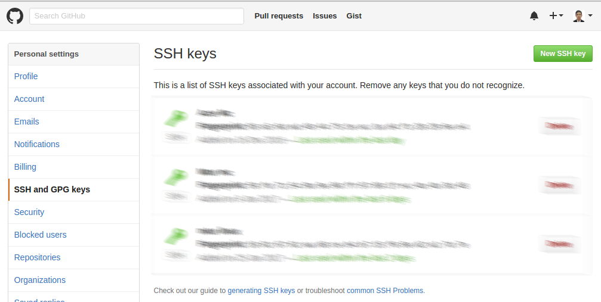

## Sumário
  * [Introdução](#introduo)
  * [Configurando chave SSH](#configurando-chave-ssh)
  * [Apresentando merge automático do Git](#Apresentando-merge-automtico-do-git)
  * [Tratando merge manual](#tratando-merge-manual)
  * [Merge entre branches](#merge-entre-branches)
  * [Merge entre branches quando há conflito](#merge-entre-branches-quando-h-conflito)
  * [Desfazendo alterações](#desfazendo-alteraes)
  * [Conclusão](#concluso)

## Introdução

No post sobre git passado, abordamos muitas operações porém com cenários bem simples. Em nenhum deles tivemos alteração concorrentes por usuários diferentes em um mesmo arquivo. E isso é algo comum de acontecer em um ambiente de trabalho. Quando isso ocorre nem sempre a ferramenta consegue realizar os merges de forma automática, e essa tarefa acaba virando responsabilidade de quem está operando o repositório. Veremos como deixar essas tarefas mais fáceis.

Se você também está cansado de ficar digitando suas senhas toda vez que vai realizar um push, ensinaremos como utilizar as chaves ssh, onde antes de toda operação de push, o git irá procurar por ela e usá-la para sua autenticação no repositório remoto. Nesse material você aprenderá sobre os alias, chega de ficar digitando tantos comandos um atrás de outros para tarefas que você acaba tendo que executar várias vezes.

## Configurando chave SSH

Antes de configurarmos nossa chave ssh temos que criá-la primeiro, para isso execute o comando abaixo.


$ ssh-keygen -t rsa -b 4096 -C "your_email@example.com"
  Generating public/private rsa key pair.
  Enter a file in which to save the key (/Users/you/.ssh/id_rsa): [Press enter]
  Enter passphrase (empty for no passphrase): [Type a passphrase]
  Enter same passphrase again: [Type passphrase again]


E você pode verificar por possíveis chaves cadastradas com esse comando.


$ ls -al ~/.ssh


Depois de gerada a chave, visite seu github, e vá para a área de configuração, no menu lateral esquerdo ache o menu **SSH and GPG keys**, aperte o botão **New SSH key**, e cole sua chave que você vai obter através do comando:


$ cat ~/.ssh/id_rsa.pub


Pronto com isso você não terá que ficar digitando sua senha do Git toda vez que for realizar um push, a autenticação será baseada na sua chave ssh.

## Apresentando merge automático do Git

É muito comum termos várias pessoas trabalhando em um mesmo projeto, com isso ocorrerão vezes onde duas ou mais pessoas irão modificar um mesmo arquivo, quando isso ocorre o Git faz um processo de merge dessas modificações, pegando tanto as alterações do usuário A e do usuário B e juntado elas no mesmo arquivo.

Para demonstrar esse comportamento teremos dois usuários, mcqueide e macaulay trabalhando no mesmo repositórios, tanto usuário mcqueide quanto o macaulay irão realizar uma modificação no nosso arquivo index.html, e a ferramenta tratará esse merge de uma forma automática e inteligente.

Segue o arquivo atual no nosso repositório:


<!DOCTYPE html>
<html>
  <head>
    <meta charset="utf-8">
    <title>Treinamento GIT</title>
  </head>
  <body>
    <h1>Treinamento GIT</h1>
  </body>
</html>


O usuário mcqueide alterou o título da página para:


...
<title>Treinamento Git</title>
...


Já o usuário macaulay alterou a tag h1 no corpo da página:


...
<h1>Treinamento Git</h1>
...


Agora ambos irão enviar essas modificações para o servidor remoto. O primeiro a enviar é o usuário mcqueide, ele realiza o `git commit` e depois faz um `git push` no repositório. Para ele foi tudo ok, não houve nenhum problema. Depois o usuário macaulay decide enviar suas alterações também, ele realiza seu **commit** até aí tudo bem, porém quando ele tenta realizar o **push** acontece o seguinte:


$ git push origin master
  Username for 'https://github.com': macaulay1001
  Password for 'https://macaulay1001@github.com':
  To https://github.com/mcqueide/treinamentoGIT.git
   ! [rejected]        master -> master (fetch first)
  error: failed to push some refs to 'https://github.com/mcqueide/treinamentoGIT.git'
  dica: Updates were rejected because the remote contains work that you do
  dica: not have locally. This is usually caused by another repository pushing
  dica: to the same ref. You may want to first integrate the remote changes
  dica: (e.g., 'git pull ...') before pushing again.
  dica: See the 'Note about fast-forwards' in 'git push --help' for details.


O git informa que o push do macaulay foi rejeitado, isso porque sua cópia local está desatualizada em relação ao repositório remoto, pois tem um novo commit do usuário mcqueide, o próprio git já dá uma dica, solicitando que ele atualize seu repositório para que fique atualizado em relação ao repositório remoto, depois disso o macaulay realiza o pull e o git direciona ele para um arquivo de texto, apresentando uma tela em seu terminal para ele digitar uma mensagem de merge:


Merge branch 'master' of https://github.com/mcqueide/treinamentoGIT
# Please enter the commit message for your changes. Lines starting
# with '#' will be ignored, and an empty message aborts the commit.
# No ramo master
#
# Submissão inicial.
#
# Mudanças a serem submetidas:
#       new file:   index.html
#


> Não é necessário apagar as linhas que estão comentadas com #, porque elas não irão para sua mensagem de commit.

Feito isso o git já informa que foi realizado um merge automático e ele realiza novamente o comando `git push` e agora seu push é aceito.


$ git pull
  remote: Counting objects: 3, done.
  remote: Compressing objects: 100% (1/1), done.
  remote: Total 3 (delta 1), reused 3 (delta 1), pack-reused 0
  Unpacking objects: 100% (3/3), done.
  From https://github.com/mcqueide/treinamentoGIT
     23b5a50..27ee314  master     -> origin/master
  Mesclagem automática de index.html
  Merge made by the 'recursive' strategy.
   index.html | 2 +-
   1 file changed, 1 insertion(+), 1 deletion(-)

$ git push origin master
  Username for 'https://github.com': macaulay1001
  Password for 'https://macaulay1001@github.com':
  Counting objects: 6, done.
  Delta compression using up to 4 threads.
  Compressing objects: 100% (4/4), done.
  Writing objects: 100% (6/6), 589 bytes | 0 bytes/s, done.
  Total 6 (delta 2), reused 0 (delta 0)
  remote: Resolving deltas: 100% (2/2), completed with 1 local objects.
  To https://github.com/mcqueide/treinamentoGIT.git
     27ee314..62b3e3e  master -> master


Agora o arquivo está com as alterações dos dois usuários:


<!DOCTYPE html>
<html>
  <head>
    <meta charset="utf-8">
    <title>Treinamento Git</title>
  </head>
  <body>
    <h1>Treinamento Git</h1>
  </body>
</html>


E se olharmos o log do repositório irá aparecer o commit do primeiro usuário, o do segundo e o commit de merge.


$ git log
  commit 62b3e3e5bd3b27726d4192e57a6d2c03c870bde2
  Merge: 22fc69d 27ee314
  Author: macaulay1001 <macaulay1001@gmail.com>
  Date:   Mon Jan 30 19:02:48 2017 -0200

      Merge branch 'master' of https://github.com/mcqueide/treinamentoGIT

  commit 27ee3147e749611875f4ef23720cfc8fb01be482
  Author: mcqueide <mcqueide@gmail.com>
  Date:   Mon Jan 30 19:00:20 2017 -0200

      Atualizando title

  commit 22fc69db0da891cc3380f6d8db6bd3c04b11159b
  Author: macaulay1001 <macaulay1001@gmail.com>
  Date:   Mon Jan 30 18:59:57 2017 -0200

      Alterando h1


Infelizmente ainda ficou o commit de merge no nosso log, isso poderia ter sido evitado se o usuário macaulay estivesse em uma branch diferente, e depois tivesse realizado o envio dessas informações para branch master. Mas veremos isso em breve.

## Tratando merge manual

Nós vimos que a ferramenta é bem inteligente a ponto de conseguir fazer um merge automático, mas as alterações realizadas foram no mesmo arquivo porém em linhas diferentes. Agora o que aconteceria se as alterações tivessem sido na mesma linha? A ferramenta seria capaz ainda de realizar o merge automático, e como ela seria capaz disso?

Para realizarmos o teste, temos o arquivo index.html no seguinte estado:


<!DOCTYPE html>
<html>
  <head>
    <meta charset="utf-8">
    <title>Treinamento Git</title>
  </head>
  <body>
    <h1>Treinamento Git</h1>

    <footer>
      Copyright - 2017
    </footer>
  </body>
</html>


O usuário mcqueide irá adicionar o nome dele no copyright do site, então ele modifica a mensagem de copyright para:


...
Copyright - 2017 | Mc.Queide
...


Depois disso ele já realiza o **commit** e o **push** dessas alterações. Agora o usuário macaulay também vai realizar uma alteração nessa mesma linha do copyright, adicionando o nome dele na mensagem de copyright.


...
Copyright - 2017 | Macaulay
...


Porém o usuário macaulay está sem as alterações submetidas pelo usuário mcqueide, então ele realiza o **commit**, mas quando ele executa o **push** ele recebe a seguinte mensagem:


$ git commit -am "Adicionando Macaulay na mensagem de copyright"
  [master e5805f4] Adicionando Macaulay na mensagem de copyright
   1 file changed, 1 insertion(+), 1 deletion(-)

$ git push origin master
  Username for 'https://github.com': macaulay1001
  Password for 'https://macaulay1001@github.com':
  To https://github.com/mcqueide/treinamentoGIT.git
   ! [rejected]        master -> master (fetch first)
  error: failed to push some refs to 'https://github.com/mcqueide/treinamentoGIT.git'
  dica: Updates were rejected because the remote contains work that you do
  dica: not have locally. This is usually caused by another repository pushing
  dica: to the same ref. You may want to first integrate the remote changes
  dica: (e.g., 'git pull ...') before pushing again.
  dica: See the 'Note about fast-forwards' in 'git push --help' for details.


Seu push foi rejeitado novamente, devido o repositório remoto está uma revisão a frente do repositório local do usuário macaulay. Então assim como o usuário macaulay fez no exemplo anterior, ele atualiza sua branch local com o `git pull`. Mas quando ele executa o **pull**, é apresentado o seguinte resultado:


$ git pull
  remote: Counting objects: 3, done.
  remote: Compressing objects: 100% (1/1), done.
  remote: Total 3 (delta 1), reused 3 (delta 1), pack-reused 0
  Unpacking objects: 100% (3/3), done.
  From https://github.com/mcqueide/treinamentoGIT
     69e134b..5e78803  master     -> origin/master
  Mesclagem automática de index.html
  CONFLITO (conteúdo): conflito de mesclagem em index.html
  Automatic merge failed; fix conflicts and then commit the result.


Diferente da primeira vez, o git não foi capaz de realizar o merge automático, então ele passa a responsabilidade para o usuário. Se abrirmos o arquivo index.html, veremos que ele está no seguinte estado:


<!DOCTYPE html>
<html>
  <head>
    <meta charset="utf-8">
    <title>Treinamento Git</title>
  </head>
  <body>
    <h1>Treinamento Git</h1>

    <footer>
<<<<<<< HEAD
      Copyright - 2017 | Macaulay
=======
      Copyright - 2017 | Mc.Queide
\>>>>>>> 5e78803bb99fa975ca550eb8301ec105fe777925
    </footer>
  </body>
</html>


Para sinalizar onde houve o conflito, o git adiciona algumas marcações, ele envolve o trecho conflitante com **<<<<<<HEAD** e **>>>>>> Hash da Revisão**. O que está entre **<<<<<<< HEAD** e **=======** são as alterações local, o que está entre **=======** e **>>>>>>>** 5e78803bb99fa975ca550eb8301ec105fe777925 são as alterações atual do repositório remoto. Então o git sinaliza onde houve o conflito e espera que o usuário o resolvê, para resolvermos esse conflito vamos remover a marcação do git e colocarmos os nomes dos dois usuários no copyright, deixando o arquivo com o seguinte estado:


<!DOCTYPE html>
<html>
  <head>
    <meta charset="utf-8">
    <title>Treinamento Git</title>
  </head>
  <body>
    <h1>Treinamento Git</h1>

    <footer>
      Copyright - 2017 | Macaulay & Mc.Queide
    </footer>
  </body>
</html>


Pronto, finalizamos a operação de merge manual, mas para o git esse arquivo ainda está com conflito, então temos que realizar o `git add` no arquivo, o **commit** do merge e após isso realizar o push para o repositório remoto.


$ git status
  No ramo master
  O seu ramo e 'origin/master' divergiram-se,
  e cada um tem 1 e 1 submissão, respectivamente.
    (use "git pull" to merge the remote branch into yours)
  Você tem caminhos não mesclados.
    (fixar conflitos e executar "git commit")

  Caminhos não mesclados:
    (usar "git add <arquivo>..." para marcar resolução)

  	ambos modificados:   index.html

  nenhuma modificação adicionada à submissão (utilize "git add" e/ou "git commit -a")

$ git add index.html

$ git status
  No ramo master
  O seu ramo e 'origin/master' divergiram-se,
  e cada um tem 1 e 1 submissão, respectivamente.
    (use "git pull" to merge the remote branch into yours)
  Todos os conflitos foram corrigidos mas você continua mesclando.
    (use  "git commit" para concluir a mesclagem)

  Mudanças a serem submetidas:

  	modified:   index.html

$ git commit -m "Realizando o merge no arquivo index.html"
  [master 2b4547a] Realizando o merge no arquivo index.html

$ git push origin master
  Username for 'https://github.com': macaulay1001
  Password for 'https://macaulay1001@github.com':
  Counting objects: 6, done.
  Delta compression using up to 4 threads.
  Compressing objects: 100% (4/4), done.
  Writing objects: 100% (6/6), 605 bytes | 0 bytes/s, done.
  Total 6 (delta 2), reused 0 (delta 0)
  remote: Resolving deltas: 100% (2/2), completed with 1 local objects.
  To https://github.com/mcqueide/treinamentoGIT.git
     5e78803..2b4547a  master -> master


## Merge entre branches

Nós simulamos o cenários onde 2 usuários trabalhavam na mesma branch, mais uma boa prática é separamos uma branch de desenvolvimento da nossa branch principal que é a master, dessa forma colocamos o conteúdo de desenvolvimento na branch master quando a funcionalidade estiver finalizada. Fazendo com o conteúdo da branch master sempre esteja estável.

Então vamos criar duas novas branches, uma para o usuário mcqueide e outra para o usuário macaulay, ambos irão desenvolver em suas branches particulares e depois mandar suas alterações para a branch master quando suas tarefas estiverem finalizadas.


mcqueide:/tmp/repo/treinamentoGit $ git checkout -b mcqueide
macaulay:/tmp/repo/treinamentoGit $ git checkout -b macaulay


Vamos partir nessa seção com nosso arquivo index.html no seguinte estado:


<!DOCTYPE html>
<html>
  <head>
    <meta charset="utf-8">
    <title>Treinamento Git</title>
  </head>
  <body>
    <header>
        <h1>Título da Página</h1>
    </header>

    <main>
      Conteúdo da página
    </main>

    <footer>
      Rodapé da página
    </footer>
  </body>
</html>


O usuário mcqueide já está com seu ramo atualizado, e irá começar seu trabalho, sua primeira tarefa é alterar o título da página. Ele define o título da página como **TreinamentoGit**, depois que ele define o título da página ele realiza o commit.


...
<h1>Treinamento Git</h1>
...



mcqueide:/tmp/repo/treinamentoGit $ git commit -am "Alterando título da página"
  [mcqueide a1c8022] Alterando título da página
   1 file changed, 1 insertion(+), 1 deletion(-)


Enquanto isso o macaulay está realizando sua atividade na sua branch particular,  ele define o rodapé da página, e o altera para **TreinamentoGit | CopyRight 2017**.

Então o usuário mcqueide irá enviar seu commit para a branch master, lembrando que o commit que ele realizou foi na branch particular dele, então primeiros temos que levar esse commit para a branch master e depois enviá-lo para o repositório remoto. Primeiro ele faz o **checkout** para branch master, executa o `git pull` para ter certeza se não novas alterações, e em seguida faz o **merge** da branch master com sua branch. Depois de realizar o **merge**, se executarmos o `git log` veremos que o commit que ele realizou na branch mcqueide, já se encontra na branch master, então podemos enviar para o repositório remoto com o `git push`.


mcqueide:/tmp/repo/treinamentoGit $ git checkout master
  Switched to branch 'master'
  Your branch is up-to-date with 'origin/master'.
  mcqueide:/tmp/repo/treinamentoGit $ git pull
  Already up-to-date.

mcqueide:/tmp/repo/treinamentoGit $ git merge mcqueide
  Updating 3524039..a1c8022
  Fast-forward
   index.html | 2 +-
   1 file changed, 1 insertion(+), 1 deletion(-)

mcqueide:/tmp/repo/treinamentoGit $ git log
  commit a1c80223de43f1f33c6bcb2cbe1d460c5bee1407
  Author: John Mc.Queide <mcqueide@gmail.com>
  Date:   Sat Feb 4 11:44:44 2017 -0200

      Alterando título da página

mcqueide:/tmp/repo/treinamentoGit $ git push origin master
  Counting objects: 3, done.
  Delta compression using up to 4 threads.
  Compressing objects: 100% (2/2), done.
  Writing objects: 100% (3/3), 311 bytes | 0 bytes/s, done.
  Total 3 (delta 1), reused 0 (delta 0)
  remote: Resolving deltas: 100% (1/1), completed with 1 local objects.
  To git@github.com:mcqueide/treinamentoGIT.git
     3524039..a1c8022  master -> master


O usuário macaulay termina sua alteração e realiza o commit na sua branch.


macaulay:/tmp/repo/treinamentoGit $ git commit -am "Alterando rodapé da página"
  [macaulay 0aa318e] Alterando rodapé da página
   1 file changed, 1 insertion(+), 1 deletion(-)


Agora o usuário macaulay vai enviar suas alterações para o repositório remoto, lembrando que ele também está na sua branch particular. Como primeiro passo, o usuário macaulay faz o **checkout** para branch master e nela realiza o **pull**, nisso o git traz as alterações realizada pelo usuário mcqueide para sua branch local, deixando ela atualizada, então ele pode realizar o merge direto da branch master com a branch macaulay, porém isso gera mais um commit de merge no qual queremos evitar, então temos que atualizar sua branch primeiro. Sabendo disso o usuário macaulay muda para sua branch, e para atualizar ela executa o `git rebase`, o **rebase** vai trazer commit a commit e aplicar na branch destino e sem aplicar nenhum commit de merge, caso haja algum conflito. Depois de atualizar sua branch de trabalho, ele volta para a branch master e agora sim realizar o **merge** e envia as alterações para o repositório remoto.


macaulay:/tmp/repo/treinamentoGit $ git checkout master
  Switched to branch 'master'
  Your branch is up-to-date with 'origin/master'.

macaulay:/tmp/repo/treinamentoGit $ git pull
  remote: Counting objects: 3, done.
  remote: Compressing objects: 100% (1/1), done.
  remote: Total 3 (delta 1), reused 3 (delta 1), pack-reused 0
  Unpacking objects: 100% (3/3), done.
  From https://github.com/mcqueide/treinamentoGIT
    d173696..18ab87e  master     -> origin/master
  Updating d173696..18ab87e
  Fast-forward
  index.html | 2 +-
  1 file changed, 1 insertion(+), 1 deletion(-)

macaulay:/tmp/repo/treinamentoGit $ git checkout macaulay
  Switched to branch 'macaulay'

macaulay:/tmp/repo/treinamentoGit $ git rebase master macaulay
  First, rewinding head to replay your work on top of it...
  Applying: Alterando rodapé da página

macaulay:/tmp/repo/treinamentoGit $ git checkout master
  Switched to branch 'master'
  Your branch is up-to-date with 'origin/master'.

macaulay:/tmp/repo/treinamentoGit $ git merge macaulay
  Updating 18ab87e..e484439
  Fast-forward
  index.html | 2 +-
  1 file changed, 1 insertion(+), 1 deletion(-)

macaulay:/tmp/repo/treinamentoGit $ git push origin master
  Username for 'https://github.com': macaulay1001
  Password for 'https://macaulay1001@github.com':
  Counting objects: 3, done.
  Delta compression using up to 4 threads.
  Compressing objects: 100% (2/2), done.
  Writing objects: 100% (3/3), 322 bytes | 0 bytes/s, done.
  Total 3 (delta 1), reused 0 (delta 0)
  remote: Resolving deltas: 100% (1/1), completed with 1 local objects.
  To https://github.com/mcqueide/treinamentoGIT.git
    18ab87e..e484439  master -> master


## Merge entre branches quando há conflito

Acabamos de ver como realizar o merge entre branches, mas e quando ocorre conflito? Como podemos resolver eles?

Para simularmos esse cenário, vamos trabalhar com o seguinte arquivo **index.html**.


<!DOCTYPE html>
<html>
  <head>
    <meta charset="utf-8">
    <title>Treinamento Git</title>
  </head>
  <body>
    <header>
        <h1>Título da Página</h1>
    </header>

    <main>
      Conteúdo da página
    </main>

    <footer>
      Rodapé da página
    </footer>
  </body>
</html>


O usuário mcqueide vai iniciar suas alterações na página, ele começa alterando o título da página para **<h1>Treinamento Git</h1>**, e realiza o commit.


mcqueide:/tmp/repo/treinamentoGit $ git commit -am "Alterando o título da página"
  [mcqueide a8680e9] Alterando o título da página
  1 file changed, 1 insertion(+), 1 deletion(-)


Agora ele altera o corpo da página, com o seguinte conteúdo:


...
<main>
  
Está é uma página para simulação de conflito com merge de branchs.

</main>
...


E realiza o commit das alterações:


mcqueide:/tmp/repo/treinamentoGit $ git commit -am "Alterando o corpo da página"
  [mcqueide 3c96082] Alterando o corpo da página
   1 file changed, 1 insertion(+), 1 deletion(-)


E por último ele realiza uma alteração no rodapé da página:


...
<footer>
  Treinamento Git | Copyright 2017
</footer>
...


E ele executa o commit:


mcqueide:/tmp/repo/treinamentoGit $ git commit -am "Alterando o rodapé da página"
  [mcqueide ae4a0b1] Alterando o rodapé da página
   1 file changed, 1 insertion(+), 1 deletion(-)


Então ele decide enviar os commit para o repositório remoto.


mcqueide:/tmp/repo/treinamentoGit $ git checkout master
  Switched to branch 'master'
  Your branch is up-to-date with 'origin/master'.

mcqueide:/tmp/repo/treinamentoGit $ git pull
  Already up-to-date.

mcqueide:/tmp/repo/treinamentoGit $ git merge mcqueide
  Updating 1df326a..ae4a0b1
  Fast-forward
   index.html | 6 +++---
   1 file changed, 3 insertions(+), 3 deletions(-)

mcqueide:/tmp/repo/treinamentoGit $ git push origin master
  Username for 'https://github.com': mcqueide
  Password for 'https://mcqueide@github.com':
  Counting objects: 9, done.
  Delta compression using up to 4 threads.
  Compressing objects: 100% (6/6), done.
  Writing objects: 100% (9/9), 914 bytes | 0 bytes/s, done.
  Total 9 (delta 3), reused 0 (delta 0)
  remote: Resolving deltas: 100% (3/3), completed with 1 local objects.
  To https://github.com/mcqueide/treinamentoGIT.git
     1df326a..ae4a0b1  master -> master


O usuário macaulay estava trabalhando paralelamente com o usuário mcqueide, e portanto não têm as alterações do outro usuário na sua branch. Ele também realiza alterações no documento. Ele começa alterando o título da página e logo em seguida executa o `git commit`.


...
<h1>TREINAMENTO GIT</h1>
...



macaulay:/tmp/repo/treinamentoGit $ git commit -am "Atualizando o título do documento"
  [macaulay 92aa3d4] Atualizando o título do documento
   1 file changed, 1 insertion(+), 1 deletion(-)


Agora o usuário macaulay atualiza o conteúdo do rodapé realizando o commit em seguida.


...
<footer>
 TREINAMENTO GIT | COPYRIGHT 2017
</footer>
...



macaulay:/tmp/repo/treinamentoGit $ git commit -am "Atualizando o rodapé do documento"
  [macaulay afab70c] Atualizando o rodapé do documento
   1 file changed, 1 insertion(+), 1 deletion(-)


Terminando essas alterações, ele deseja enviar suas alterações para o repositório remoto. Para isso, ele realiza o mesmo processo que já realizamos algumas vezes aqui, ele vai mudar para a branch master, atualizar ela, e depois voltar para a branch macaulay para atualizar ela com o conteúdo da master.


macaulay:/tmp/repo/treinamentoGit $ git checkout master
  Switched to branch 'master'
  Your branch is up-to-date with 'origin/master'.

macaulay:/tmp/repo/treinamentoGit $ git pull
  remote: Counting objects: 9, done.
  remote: Compressing objects: 100% (3/3), done.
  remote: Total 9 (delta 3), reused 9 (delta 3), pack-reused 0
  Unpacking objects: 100% (9/9), done.
  From https://github.com/mcqueide/treinamentoGIT
     1df326a..ae4a0b1  master     -> origin/master
  Updating 1df326a..ae4a0b1
  Fast-forward
   index.html | 6 +++---
   1 file changed, 3 insertions(+), 3 deletions(-)

macaulay:/tmp/repo/treinamentoGit $ git checkout macaulay
  Switched to branch 'macaulay'


Então agora ele está pronto para realizar o rebase, porém ao realizar o rebase ele obtém o seguinte resultado na sua tela do terminal.


macaulay:/tmp/repo/treinamentoGit $ git rebase master macaulay
  First, rewinding head to replay your work on top of it...
  Applying: Atualizando o título do documento
  Using index info to reconstruct a base tree...
  M	index.html
  Falling back to patching base and 3-way merge...
  Mesclagem automática de index.html
  CONFLITO (conteúdo): conflito de mesclagem em index.html
  error: Failed to merge in the changes.
  Patch failed at 0001 Atualizando o título do documento
  The copy of the patch that failed is found in: .git/rebase-apply/patch

  When you have resolved this problem, run "git rebase --continue".
  If you prefer to skip this patch, run "git rebase --skip" instead.
  To check out the original branch and stop rebasing, run "git rebase --abort".


Essa mensagem informa que houve conflito durante o rebase, lembrando que o git rebase aplica commit a commit na branch que está sendo atualizada, na aplicação do primeiro commit houve um conflito que deve ser tratado, e o próprio git já dá uma dica que após  o tratamento do merge o usuário pode dar continuidade do rebase com o comando `git rebase --continue`. Então vamos tratar o primeiro conflito.


...
<header>
<<<<<<< ae4a0b1e66a0fcbd58fcf0f59894f4e1dd4f7ab2
    <h1>Treinamento Git</h1>
=======
  <h1>TREINAMENTO GIT</h1>
\>>>>>>> Atualizando o título do documento
</header>
...


O primeiro conflito foi exatamente na tag header, que foi a aplicação do primeiro commit, o usuário macaulay escolhe o título que ele mesmo colocou.


<header>
      <h1>TREINAMENTO GIT</h1>
</header>


Depois ele realiza o `git add` para informar para o git que o merge foi realizado e executa o `git rebase --continue` para dar continuidade no processo de rebase.


macaulay:/tmp/repo/treinamentoGit $ git add index.html

macaulay:/tmp/repo/treinamentoGit $ git rebase --continue
  Applying: Atualizando o título do documento
  Applying: Atualizando o rodapé do documento
  Using index info to reconstruct a base tree...
  M	index.html
  Falling back to patching base and 3-way merge...
  Mesclagem automática de index.html
  CONFLITO (conteúdo): conflito de mesclagem em index.html
  error: Failed to merge in the changes.
  Patch failed at 0002 Atualizando o rodapé do documento
  The copy of the patch that failed is found in: .git/rebase-apply/patch

  When you have resolved this problem, run "git rebase --continue".
  If you prefer to skip this patch, run "git rebase --skip" instead.
  To check out the original branch and stop rebasing, run "git rebase --abort".


E novamente ocorre um novo conflito, porém dessa vez podemos perceber que o git conseguiu aplicar o primeiro e o segundo commit, dando o conflito apenas no terceiro commit que é o do rodapé, onde os dois usuário realizaram modificações.


...
<footer>
<<<<<<< d7aa763ca2ae4899f414fe25f39bf45f27c31ce5
  Treinamento Git | Copyright 2017
=======
  TREINAMENTO GIT | COPYRIGHT 2017
\>>>>>>> Atualizando o rodapé do documento
</footer>
...


Dessa vez o usuário macaulay escolhe manter o trecho do usuário mcqueide.


...
<footer>
  Treinamento Git | Copyright 2017
</footer>
...


E novamente executa o `git add` para informar ao git que foi realizado o merge. E executa o `git rebase --continue` novamente. E como dessa vez era o último commit conflitante então ele aplica o commit e finaliza o processo.


macaulay:/tmp/repo/treinamentoGit $ git add index.html

macaulay:/tmp/repo/treinamentoGit $ git rebase --continue
  Applying: Atualizando o rodapé do documento


Agora o usuário macaulay pode retornar para a branch master e continuar o processo de envio de suas alterações para o repositório remoto.


macaulay:/tmp/repo/treinamentoGit $ git checkout master
  Switched to branch 'master'
  Your branch is up-to-date with 'origin/master'.

macaulay:/tmp/repo/treinamentoGit $ git merge macaulay
  Updating ae4a0b1..d717d81
  Fast-forward
   index.html | 4 ++--
   1 file changed, 2 insertions(+), 2 deletions(-)

macaulay:/tmp/repo/treinamentoGit $ git push origin master
  Username for 'https://github.com': macaulay1001
  Password for 'https://macaulay1001@github.com':
  Counting objects: 6, done.
  Delta compression using up to 4 threads.
  Compressing objects: 100% (4/4), done.
  Writing objects: 100% (6/6), 569 bytes | 0 bytes/s, done.
  Total 6 (delta 2), reused 0 (delta 0)
  remote: Resolving deltas: 100% (2/2), completed with 1 local objects.
  To https://github.com/mcqueide/treinamentoGIT.git
     ae4a0b1..d717d81  master -> master


## Desfazendo alterações

E o que fazemos quando queremos desfazer alguma alteração? Podemos ter várias respostas para essa pergunta, tudo irá depender do status que nosso arquivo se encontra.

Quando o arquivo foi modificado mas não foi adicionado para realização de commit podemos fazer esse arquivo voltar para seu estado original com o `git checkout nome_do_arquivo`.

Para simularmos esse cenário vamos utilizar o seguinte arquivo como início.


<!DOCTYPE html>
<html>
  <head>
    <meta charset="utf-8">
    <title>Treinamento Git</title>
  </head>
  <body>
    <header>
      <h1>TREINAMENTO GIT</h1>
    </header>

    <main>
    </main>

    <footer>
       Treinamento Git | Copyright 2017
    </footer>
  </body>
</html>


Dentro da tag main adicione qualquer texto, por exemplo testando **git checkout** em arquivo. Após isso execute o `git status`.


mcqueide:/tmp/repo/treinamentoGit $ git status
  No ramo master
  Your branch is up-to-date with 'origin/master'.
  Changes not staged for commit:
    (utilize "git add <arquivo>..." para atualizar o que será submetido)
    (utilize "git checkout -- <arquivo>..." para descartar mudanças no diretório de trabalho)

  	modified:   index.html

  nenhuma modificação adicionada à submissão (utilize "git add" e/ou "git commit -a")


> Quando o arquivo tiver o nome igual a de uma branch existente, você pode adicionar -- para o git saber que trata-se de um arquivo. Ficando git checkout -- nome_do_arquivo.

Note que o git já oferece algumas dicas do que você pode fazer com esse arquivo. Ele fala que podemos descartar as alterações feitas com o comando `git checkout`. Então vamos fazer isso e executar o `git status` para ver se ainda tem alguma alteração.


mcqueide:/tmp/repo/treinamentoGit $ git checkout index.html

mcqueide:/tmp/repo/treinamentoGit $ git status
  No ramo master
  Your branch is up-to-date with 'origin/master'.
  nada a submeter, diretório de trabalho vazio


Ao abrir o arquivo você pode notar que o arquivo foi restaurado para o estado anterior. O git checkout resolveu esse caso, mas e se já tivéssemos executado o git add? O git checkout não vai conseguir resolver. Então vamos ao exemplo. Vamos adicionar novamente qualquer texto na tag main. Depois adicione o arquivo mas não faça o commit e execute o `git status`.


mcqueide:/tmp/repo/treinamentoGit $ git add index.html

mcqueide:/tmp/repo/treinamentoGit $ git status
  No ramo master
  Your branch is up-to-date with 'origin/master'.
  Mudanças a serem submetidas:
    (use "git reset HEAD <file>..." to unstage)

  	modified:   index.html


Note que o git novamente dá dicas do que podemos fazer, para esse caso ele sugere que execute o comando `git reset HEAD nome_arquivo`, com isso o git retira o arquivo do estado para ser enviado. Se executarmos o git status novamente veremos que ele só retirou o arquivo do stage, mas não desfez as alterações, para fazer isso podemos executar novamente o `git checkout` e executar o `git status` para verificar se realmente foi desfeitas as alterações.


mcqueide:/tmp/repo/treinamentoGit $ git reset HEAD index.html
  Unstaged changes after reset:
  M	index.html

mcqueide:/tmp/repo/treinamentoGit $ git status
  No ramo master
  Your branch is up-to-date with 'origin/master'.
  Changes not staged for commit:
    (utilize "git add <arquivo>..." para atualizar o que será submetido)
    (utilize "git checkout -- <arquivo>..." para descartar mudanças no diretório de trabalho)

  	modified:   index.html

  nenhuma modificação adicionada à submissão (utilize "git add" e/ou "git commit -a")

mcqueide:/tmp/repo/treinamentoGit $ git checkout index.html

mcqueide:/tmp/repo/treinamentoGit $ git status
  No ramo master
  Your branch is up-to-date with 'origin/master'.
  nada a submeter, diretório de trabalho vazio


Se tivermos realizado o commit podemos voltar para algum estado anterior desfazendo as alterações do commit com o git reset. Para simularmos esse cenário, vamos utilizar o arquivo index.html com o seguinte estado.


<!DOCTYPE html>
<html>
  <head>
    <meta charset="utf-8">
    <title>Treinamento Git</title>
  </head>
  <body>
    <header>
    </header>

    <main>
    </main>

    <footer>
    </footer>
  </body>
</html>


Vamos adicionar um título e rodapé na página e realizar um commit.


...
<header>
  Treinamento Git
</header>
...
<footer>
  Treinamento Git | CopyRight 2017
</footer>
...



mcqueide:/tmp/repo/treinamentoGit $ git commit -am "Adicionando título e rodapé na página"
  [master 0ed3c86] Adicionando título e rodapé na página
   1 file changed, 2 insertions(+)


Vamos agora adicionar algum texto no corpo da página. E realizar outro commit.


...
<main>
  Testa o git reset em commit.
</main>
...



mcqueide:/tmp/repo/treinamentoGit $ git commit -am "Adicionando corpo na página"
  [master 09cbef2] Adicionando corpo na página
   1 file changed, 1 insertion(+)


Se executarmos o `git log` veremos que os dois commit estão lá. Mas digamos que não estamos satisfeitos com a última alteração enviada e desejamos desfazê-la. Para isso vamos recorrer ao comando `git reset`, passando o identificador do commit obtido no `git log` para qual queremos retornar. E depois podemos executar o `git checkout` para desfazer as alterações do arquivo.


mcqueide:/tmp/repo/treinamentoGit $ git log
  commit 09cbef21fe83420a68139ad55b9fd62dcbd9995d
  Author: John Mc.Queide <mcqueide@gmail.com>
  Date:   Sat Feb 11 11:07:47 2017 -0200

      Adicionando corpo na página

  commit 0ed3c86a97fec223d7ae11680d6a5c0086dc07ed
  Author: John Mc.Queide <mcqueide@gmail.com>
  Date:   Sat Feb 11 10:58:02 2017 -0200

      Adicionando título e rodapé na página

mcqueide:/tmp/repo/treinamentoGit $ git reset 0ed3c86a97fec223d7ae11680d6a5c0086dc07ed
  Unstaged changes after reset:
  M	index.html

mcqueide:/tmp/repo/treinamentoGit $ git log
  commit 0ed3c86a97fec223d7ae11680d6a5c0086dc07ed
  Author: John Mc.Queide <mcqueide@gmail.com>
  Date:   Sat Feb 11 10:58:02 2017 -0200

      Adicionando título e rodapé na página

mcqueide:/tmp/repo/treinamentoGit $ git checkout index.html


No exemplo, nós desfizemos apenas um commit, mas podemos desfazer quantos commit desejarmos, é necessário apenas passar o commit para qual desejamos retornar.

Mas e se o commit que queremos desfazer está entre outros commits? Se executarmos o git reset, ele irá desfazer inclusive os commits que não queremos desfazer. Para isso vamos usar o git revert, com ele podemos escolher apenas o commit que queremos reverter especificamente.

Para isso vamos preparar nosso teste. Vamos voltar no arquivo index.html para o seguinte estado novamente.


<!DOCTYPE html>
<html>
  <head>
    <meta charset="utf-8">
    <title>Treinamento Git</title>
  </head>
  <body>
    <header>
    </header>

    <main>
    </main>

    <footer>
    </footer>
  </body>
</html>


Vamos adicionar um título na página e realizar o commit logo em seguida.


...
<header>
  Treinamento Git
</header>
...



mcqueide:/tmp/repo/treinamentoGit $ git commit -am "Adicionando título na página"
  [master 3e19069] Adicionando título na página
   1 file changed, 1 insertion(+)


Agora adicionaremos um rodapé da página e fazendo o commit em seguida novamente.


...
<footer>
  Treinamento Git | CopyRight 2017
</footer>
...



mcqueide:/tmp/repo/treinamentoGit $ git commit -am "Adicionando rodapé"
  [master 425e08d] Adicionando rodapé
   1 file changed, 1 insertion(+)


Vamos para a nossa terceira alteração, adicione um corpo na página agora.


...
<main>
  Testando o git reset
</main>
...



mcqueide:/tmp/repo/treinamentoGit $ git commit -am "Adicionando corpo"
  [master 9e42004] Adicionando corpo
   1 file changed, 1 insertion(+)


Mas não estamos satisfeitos com a mensagem que colocamos no rodapé, e queremos desfazer essa alteração. O problema é que ela está entre a alteração do título e do corpo. Então vamos utilizar o `git revert` para desfazer apenas o commit do rodapé. Para iniciar execute o `git log` para obtermos o identificador do commit, e depois execute o `git revert`.


mcqueide:/tmp/repo/treinamentoGit $ git log
  commit 9e42004c4a873646bfc692f705c4ae43f5d34c34
  Author: John Mc.Queide <mcqueide@gmail.com>
  Date:   Sat Feb 11 11:32:50 2017 -0200

      Adicionando corpo

  commit 425e08dbe86907dd157ba37e7907d028b232fb79
  Author: John Mc.Queide <mcqueide@gmail.com>
  Date:   Sat Feb 11 11:30:06 2017 -0200

      Adicionando rodapé

  commit 3e19069c9b4f45cca30bee93637d542765b5eddf
  Author: John Mc.Queide <mcqueide@gmail.com>
  Date:   Sat Feb 11 11:27:10 2017 -0200

      Adicionando título na página

mcqueide:/tmp/repo/treinamentoGit $ git revert 425e08dbe86907dd157ba37e7907d028b232fb79


O git irá abrir um arquivo temporário para passarmos uma mensagem de commit.


Revertendo o commit "Adicionando rodapé"

This reverts commit 425e08dbe86907dd157ba37e7907d028b232fb79.

# Please enter the commit message for your changes. Lines starting
# with '#' will be ignored, and an empty message aborts the commit.
# No ramo master
# Seu ramo está à frente de 'origin/master' por 6 submissões.
#   (use "git push" to publish your local commits)
#
# Mudanças a serem submetidas:
#       modified:   index.html
#


> Lembrando que o que está com # no início da linha não irá na mensagem de commit, por que é linha comentada.

Depois se executarmos o git log novamente veremos que temos um commit de revert, e nosso arquivo ficou sem as alterações realizada no commit revertido.


mcqueide:/tmp/repo/treinamentoGit $ git log
  commit fbdb67f8441b52734458784af252ea439d50c00e
  Author: John Mc.Queide <mcqueide@gmail.com>
  Date:   Sat Feb 11 11:38:58 2017 -0200

      Revertendo o commit "Adicionando rodapé"

      This reverts commit 425e08dbe86907dd157ba37e7907d028b232fb79.

  commit 9e42004c4a873646bfc692f705c4ae43f5d34c34
  Author: John Mc.Queide <mcqueide@gmail.com>
  Date:   Sat Feb 11 11:32:50 2017 -0200

      Adicionando corpo

  commit 425e08dbe86907dd157ba37e7907d028b232fb79
  Author: John Mc.Queide <mcqueide@gmail.com>
  Date:   Sat Feb 11 11:30:06 2017 -0200

      Adicionando rodapé

  commit 3e19069c9b4f45cca30bee93637d542765b5eddf
  Author: John Mc.Queide <mcqueide@gmail.com>
  Date:   Sat Feb 11 11:27:10 2017 -0200

      Adicionando título na página



<!DOCTYPE html>
<html>
  <head>
    <meta charset="utf-8">
    <title>Treinamento Git</title>
  </head>
  <body>
    <header>
      Treinamento Git
    </header>

    <main>
      Testando o git reset
    </main>

    <footer>
    </footer>
  </body>
</html>

